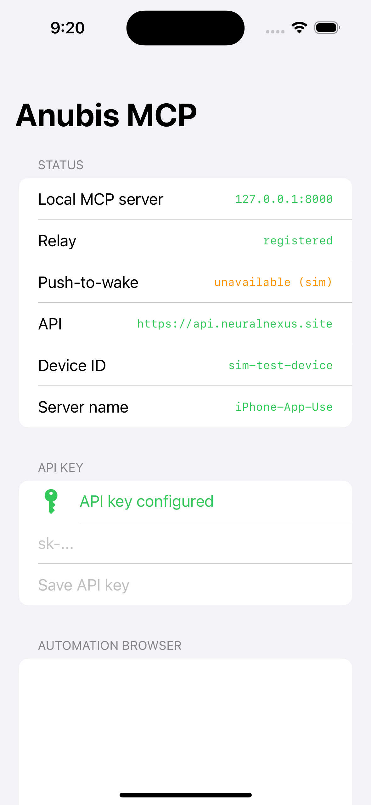

# anubis-mcp-server-phone (iOS)

A **native iOS app that embeds an always-on MCP server**. It connects outbound to
the NeuralNexus / [anubis](https://github.com/efwoods/anubis) API so an LLM avatar
can perform tasks on the phone on the user's behalf — launching apps, driving an
in-app browser, running Siri Shortcuts, and reading/writing phone data.

The app is **not driven by the user directly**. It is a connection/relay point plus
a toolbelt the avatar calls into. It works **published and untethered** — no Mac,
Appium, or WebDriverAgent tether — using only App Store–legal capabilities.

This is the iOS counterpart of
[`anubis-mcp-server-ubuntu-desktop`](https://github.com/AfterlifeSystems/anubis-mcp-server-ubuntu-desktop)
and speaks the exact same relay wire protocol. Android is out of scope.

> Proof-of-concept, matching the framing of the reference works
> ([lakr233/iphone-mcp](https://github.com/Lakr233/iphone-mcp)). See
> [background execution](#background-execution-the-always-on-caveat) for what
> "always on" means on iOS.

## Architecture

```
        LLM avatar (anubis)                    This iPhone app
   ┌──────────────────────────┐        ┌────────────────────────────────┐
   │ MultiServerMCPClient      │        │ OutboundRelay (URLSessionWS)   │
   │  → POST /mcp/relay/<id>   │        │  • register frame on connect   │
   └───────────┬──────────────┘        │  • pong on ping/heartbeat      │
               │                        │  • proxy → replay locally      │
      api.neuralnexus.site              │                                │
   ┌───────────▼──────────────┐  wss    │  HTTPServerService (FlyingFox) │
   │ /mcp/relay  (WebSocket)  │◄────────┤   127.0.0.1  GET /health       │
   │ /mcp/register /heartbeat │  HTTPS  │             POST /mcp          │
   │ /mcp/relay/<id> (bridge) │◄────────┤   Bearer <device_secret> auth  │
   └──────────────────────────┘         │                                │
                                        │  MCPHandler (JSON-RPC 2.0)     │
                                        │  ToolRegistry → 24 tools       │
                                        └────────────────────────────────┘
```

The app opens **one outbound WebSocket** to `wss://api.neuralnexus.site/mcp/relay`
(authenticated with the user's `sk-...` API key). No inbound ports are exposed. The
API tunnels each MCP HTTP call as a `proxy` frame; the app replays it against its
loopback-only server and returns a `proxy_response`. The embedded server itself is
a standard **MCP streamable-HTTP** endpoint guarded by a per-device Bearer secret —
so it is byte-compatible with the Python `mcp` / `langchain_mcp_adapters` client the
avatar uses.

### Source layout

| Path | Role |
|------|------|
| `project.yml` | XcodeGen project spec (iOS 17.0 target, FlyingFox SPM dep) |
| `AnubisMCP/App/` | `@main` app + `ServerController` orchestration |
| `AnubisMCP/Config/DeviceConfig.swift` | device identity, API URL, keychain, credentials |
| `AnubisMCP/Server/` | FlyingFox HTTP server + MCP JSON-RPC handler + tool registry |
| `AnubisMCP/Relay/` | `OutboundRelay` (WebSocket bridge) + `Registrar` (register/heartbeat) |
| `AnubisMCP/Tools/` | the 24 tools (device, apps, shortcuts, comms, PIM, location, browser) |
| `AnubisMCP/Intents/` | App Intents surface for Siri / Shortcuts |
| `AnubisMCP/UI/StatusView.swift` | operator console + hosted automation browser |

## Tools exposed to the avatar

**Device** — `device_info`, `battery_status`, `clipboard_get`, `clipboard_set`,
`send_notification`
**App use** — `list_apps`, `open_app` (curated deep-link registry: Maps, DoorDash,
Uber Eats, Grubhub, Yelp, OpenTable, Uber/Lyft, …), `open_url`
**Automation** — `run_shortcut` (run the user's Siri Shortcuts by name — the
sanctioned path for multi-app actions like ordering food or controlling smart home)
**Comms** — `place_call`, `compose_sms`, `compose_email`
**Personal data** (permission-gated) — `contacts_search`, `calendar_list_events`,
`calendar_create_event`, `reminders_create`, `get_location`
**Browser** (full in-app WKWebView automation) — `browser_navigate`,
`browser_snapshot` (token-lean indexed DOM outline), `browser_click`,
`browser_fill`, `browser_evaluate_js`, `browser_screenshot`, `browser_back`

## Why these tools (and not XCUITest)

A published, sandboxed iOS app **cannot** drive other apps' native UI — Apple only
allows that via XCUITest / WebDriverAgent, which requires a permanent Mac tether and
can never ship on the App Store. The Apple-sanctioned equivalents this app uses:

- **Deep links / URL schemes** to launch and jump into other apps
- **App Intents & Siri Shortcuts** for cross-app, multi-step automations
- **In-app WKWebView** for full browser use (any website task, end to end)
- **System frameworks** (Contacts, EventKit, CoreLocation, MessageUI) for data

## Build & run (simulator)

Requires Xcode 15+ and [XcodeGen](https://github.com/yonaskolb/XcodeGen)
(`brew install xcodegen`).

```bash
xcodegen generate                 # project.yml → AnubisMCP.xcodeproj (SPM resolves FlyingFox)

# Build + install + run on an iOS 17 simulator, passing the API key via the
# launch environment so the secret never lands in the app container or repo.
xcodebuild -project AnubisMCP.xcodeproj -scheme AnubisMCP \
  -destination 'platform=iOS Simulator,OS=17.5,name=iPhone 15' build

xcrun simctl boot 'iPhone 15'
xcrun simctl install booted <path-to>/AnubisMCP.app
SIMCTL_CHILD_ANUBIS_API_KEY='sk-...' xcrun simctl launch booted site.neuralnexus.anubis-mcp
```

In normal use the user instead pastes their `sk-...` key once into the app's setup
screen (stored in the keychain). On launch the app starts the local server, opens
the relay, and registers — the status screen turns green when `Relay → registered`.

### Configuration (environment overrides, all optional)

| Variable | Default | Purpose |
|----------|---------|---------|
| `ANUBIS_API_KEY` | *(keychain)* | user's `sk-...` API key |
| `ANUBIS_API_BASE_URL` | `https://api.neuralnexus.site` | API host (point at a mock for testing) |
| `ANUBIS_SERVER_NAME` | `iPhone-App-Use` | server name announced to the avatar |
| `ANUBIS_MCP_PORT` | `8000` | local server port |
| `ANUBIS_DEVICE_ID` / `ANUBIS_DEVICE_SECRET` | *(generated + keychained)* | test-only fixed identity |
| `ANUBIS_PUSH_ENV` | `sandbox` (Debug) / `production` | APNs environment sent to the API |
| `ANUBIS_WAKE_TEST` | *(unset)* | `1` fires the wake path ~8s after launch (simulator test hook) |

## Verification

Verified on an **iPhone 15 / iOS 17.5** simulator (`xcrun simctl privacy … grant`
pre-authorizes contacts/calendar/location):

- **Local MCP** — `GET /health` → 200; unauthenticated `POST /mcp` → 401; full
  `initialize` → `tools/list` (24) → `tools/call` with the device Bearer secret.
- **Client compatibility** — the real Python `mcp` streamable-HTTP client (the
  transport under `langchain_mcp_adapters` the avatar uses) completed
  `initialize` / `tools/list` / `call_tool` against the phone.
- **Tools** — `device_info` (reports iOS 17.5), clipboard round-trip, `list_apps`
  (Maps/Safari/Shortcuts installed), `browser_navigate` → `browser_snapshot` →
  `browser_click` following real navigation, `browser_screenshot` (JPEG),
  `calendar_create_event` → `calendar_list_events`, `get_location`.
- **End-to-end through the production API** — a POST to
  `https://api.neuralnexus.site/mcp/relay/<device_id>` (Cloudflare → anubis API →
  WebSocket → phone → local server → back) returned live `initialize`, `tools/list`,
  `device_info`, and `browser_navigate` results — the exact path the avatar drives.
- **Push-to-wake** — the `wake()` path (the target of both the APNs silent-push and
  `anubismcp://wake` entry points) was exercised end-to-end: on wake the relay
  reconnected and re-registered, a bridge request was serviced *inside* the wake
  window, and the window closed reporting `serviced request: true`
  (→ `completion(.newData)`). Silent-push *delivery* itself requires a device;
  `simctl` does not deliver background pushes to the handler.



## Background execution & push-to-wake

iOS suspends backgrounded apps, so a persistent outbound socket cannot be guaranteed
the way a desktop daemon's systemd service can. This app stays connected three ways,
in order of reliability:

1. **Foreground** — live whenever frontmost (idle timer disabled), reconnecting
   instantly via the `willEnterForeground` observer.
2. **Push-to-wake** — the primary background mechanism. On register/heartbeat the app
   sends its **APNs device token** and environment to the API (`apns_token`,
   `push_environment`, `platform: "ios"` — additive to the desktop wire contract).
   When the avatar needs a device whose relay socket has been torn down, the API
   sends a **silent (`content-available`) push**. The app wakes in the background
   (`remote-notification` background mode + `aps-environment` entitlement), takes a
   `UIApplication` background-task assertion, reconnects and re-registers the relay,
   and holds the assertion open through the ~30s execution window — extending while
   proxy traffic flows and finishing after ~5s of quiet — so the tunneled request(s)
   are serviced before the app suspends again. `completion(.newData)` is reported
   when a request was serviced.
3. **BGAppRefresh / processing** — declared as best-effort top-up.

```
Avatar needs offline device
        │
   API sends silent APNs push  ─────────────►  App wakes in background
        │                                            │ begin background-task assertion
        │                                            │ reconnect + register relay
   API POSTs /mcp/relay/<id>  ──(WebSocket)──►       │ replay against local server
        │◄──────────── proxy_response ───────────────┤ (window stays open while busy)
                                                      │ end assertion → completion(.newData)
```

**Entry points into the wake path** — all call the same `ServerController.wake(reason:)`:
- `application(_:didReceiveRemoteNotification:fetchCompletionHandler:)` — the APNs
  silent push (production; requires a real device — the simulator does not deliver
  silent pushes to the background handler).
- `anubismcp://wake` URL — a **Siri Shortcut / App Intent** can force a wake on demand.

**Server side (not in this repo):** the anubis API must persist the `apns_token` /
`push_environment` from register/heartbeat and send the silent push (via APNs, the
right sandbox/production endpoint) whenever `proxy_request` targets a device with no
live relay socket. The daemon fields are already emitted; wiring the APNs sender is
the API's responsibility.

Reliable 24/7 presence on iOS ultimately depends on this push-to-wake loop (Apple
does not permit unbounded background sockets) — consistent with the proof-of-concept
framing of the reference iPhone-MCP works.
